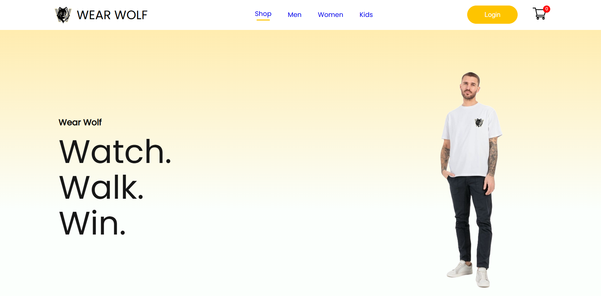

#Clothing E-Commerce Website

A full-stack clothing e-commerce web application developed as a university software engineering project.

The application combines a **React frontend** with a **Node.js / Express backend** and **MongoDB** for data storage. It includes user authentication, shopping cart functionality, and a responsive clothing-store interface.


## Features

* 👤 User registration and login
* 🔐 Secure password hashing with bcrypt
* 🔑 JWT-based authentication
* 🛒 Shopping cart functionality
* 👗 Clothing product interface
* 📱 Responsive frontend design
* 🌐 REST API with Node.js and Express
* 🗄️ MongoDB database integration
* 🔒 Environment variables for sensitive configuration

---

## Technologies

### Frontend

* React.js
* JavaScript
* HTML5
* CSS3
* React Components
* React Router

### Backend

* Node.js
* Express.js
* MongoDB
* Mongoose
* JSON Web Token (JWT)
* bcryptjs
* dotenv
* CORS

### Tools

* Git
* GitHub
* GitHub Desktop
* Visual Studio Code

---

## 📁 Project Structure

```text
clothing-ecommerce/
│
├── backend/
│   ├── index.js
│   ├── package.json
│   ├── package-lock.json
│   └── ...
│
├── frontend/
│   ├── public/
│   ├── src/
│   │   ├── assets/
│   │   ├── components/
│   │   ├── pages/
│   │   ├── App.js
│   │   ├── App.css
│   │   └── ...
│   ├── package.json
│   └── package-lock.json
│
├── .gitattributes
├── .gitignore
└── README.md
```

---

## 🔐 Authentication

The application uses JWT for authentication.

User passwords are hashed using **bcryptjs** before being stored in the database.

Sensitive information such as:

* MongoDB connection strings
* JWT secrets
* Environment-specific configuration

is stored in environment variables and is **not included in the repository**.

---

## ⚙️ Getting Started

### 1. Clone the repository

```bash
git clone https://github.com/NoDy99/clothing-ecommerce.git
```

```bash
cd clothing-ecommerce
```

---

## 🚀 Backend Setup

Navigate to the backend:

```bash
cd backend
```

Install dependencies:

```bash
npm install
```

Create a `.env` file inside the `backend` folder:

```env
MONGODB_URI=your_mongodb_connection_string
JWT_SECRET=your_jwt_secret
```

Then start the backend:

```bash
node index.js
```

The backend runs on:

```text
http://localhost:4000
```

---

## 💻 Frontend Setup

Open a second terminal and navigate to:

```bash
cd frontend
```

Install dependencies:

```bash
npm install
```

Start the React development server:

```bash
npm start
```

The frontend will normally be available at:

```text
http://localhost:3000
```

---

## 🔄 Application Flow

```text
React Frontend
      │
      │ HTTP Requests
      ▼
Node.js / Express API
      │
      │ Mongoose
      ▼
MongoDB
```

Authentication flow:

```text
User
 │
 ├── Sign Up
 │      ↓
 │   bcrypt password hashing
 │      ↓
 │   MongoDB
 │
 └── Login
        ↓
   Password verification
        ↓
   JWT token
        ↓
   Authenticated user
```

---

## Frontend

The frontend is organized into reusable React components and pages.

Main areas include:

* Navigation
* Product sections
* Product items
* User authentication
* Shopping cart
* Product-related UI
* Reusable components

The component-based structure makes the application easier to maintain and extend.

---

## Backend

The backend provides the API layer for the application.

Main technologies:

* Express.js for the server
* Mongoose for MongoDB communication
* JWT for authentication
* bcryptjs for password hashing
* dotenv for environment configuration

The backend runs independently from the React frontend and communicates through HTTP requests.

---

## Security

Security-related practices implemented in this project include:

* Password hashing with bcryptjs
* JWT authentication
* Environment variables for secrets
* `.gitignore` configuration to prevent sensitive files from being committed
* MongoDB credentials kept outside the source code

> Never commit your `.env` file or expose database credentials in the repository.

---

## Screenshots

Screenshots of the application can be added here.

### Home Page



### Login / Sign Up

*Add screenshot here*

### Product Page

*Add screenshot here*

### Shopping Cart

*Add screenshot here*

---

## 🎯 Project Goals

This project was developed to practice and demonstrate:

* Full-stack web development
* React component architecture
* REST API development
* Database integration
* User authentication
* Secure password handling
* Git and GitHub workflow
* Frontend/backend communication

---

## 🔮 Possible Future Improvements

Potential improvements for future versions include:

* Product management through a dedicated admin dashboard
* Improved product filtering and search
* Product categories
* Wishlist functionality
* Order management
* Payment integration
* Improved validation and error handling
* Deployment to a cloud platform
* Automated testing

---

## 👩‍💻 Author

**Nour Dyab**

Software Engineering Student

Germany

### Skills & Interests

* Web Development
* React
* JavaScript
* Python
* SQL
* Data & AI
* Software Engineering

---

## 📄 License

This project was developed for educational and portfolio purposes.
